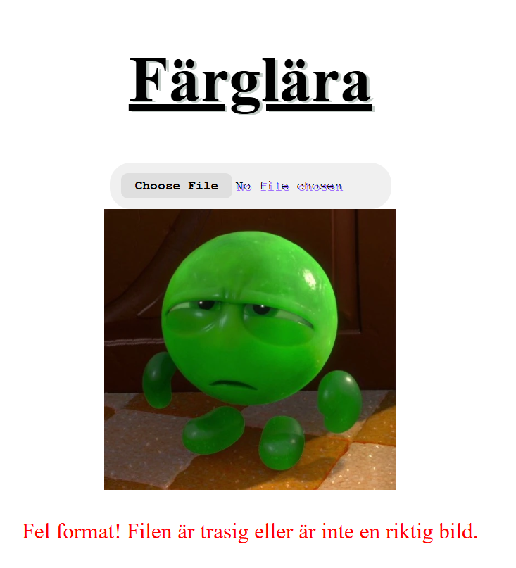

# DIGITALT SKAPANDE

## Hem (första sidan)

Det är en sida som förklarar vad de ändra sidorna innehåller, inte mycket mer att tillägga här.

## Färglära (sidan åt vänster i nav-baren)

Det är en sida då man kan skicka in en fil o lägga på två olika filter. Just nu är det för invert och en gråskala. Varför det har med färgteori att göra beror på att man kan se skillnader i färgerna (invert = motsatt.) Detta fungerar även för videor och gifs osv.

## Gyllene snittet (sidan åt höger i nav-baren)

Det är en sida med information om det gyllene snittet.

## Manuella och automatiska tester

Jag testade själv koden på Chrome, Brave och Edge. Alla fungerade.

Använde mig utav denna hemsida för tester av

- HTML : https://validator.w3.org/nu/
- CSS : https://jigsaw.w3.org/css-validator/#validate_by_upload
- JAVASCRIPT : jshint.com & https://eslint.org/play/

## uhuh

